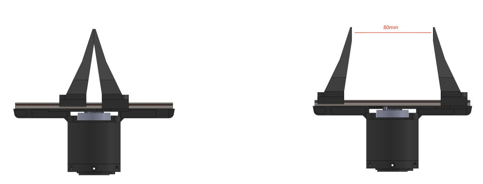
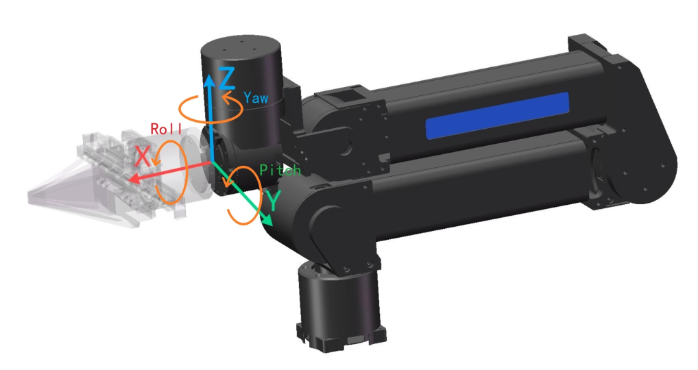
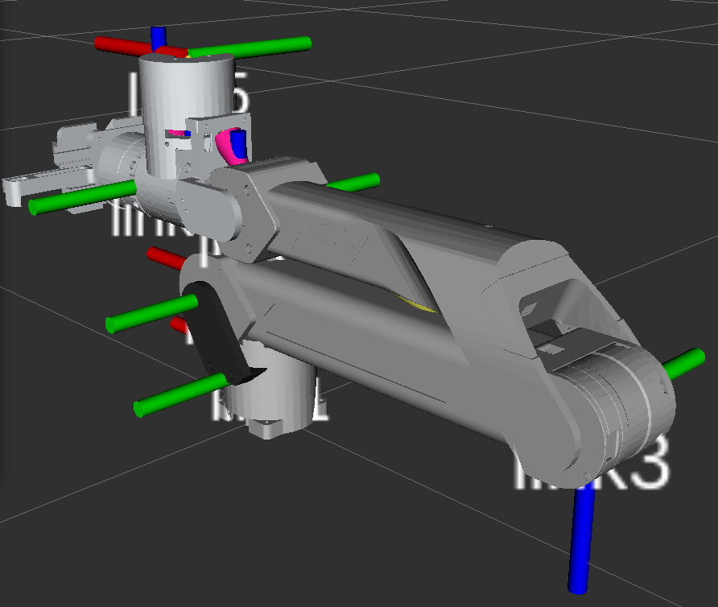
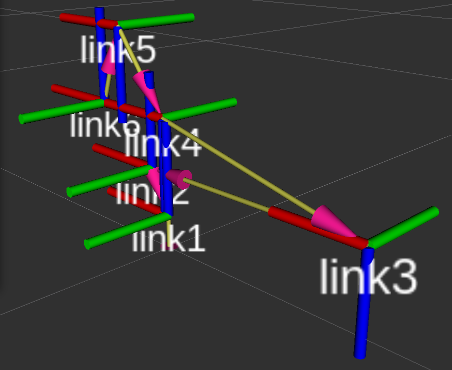
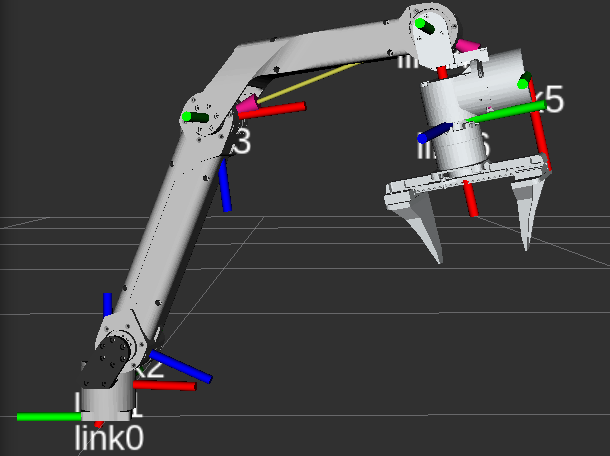
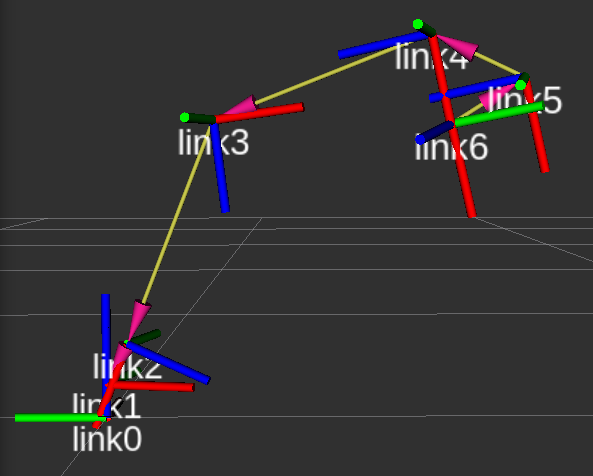
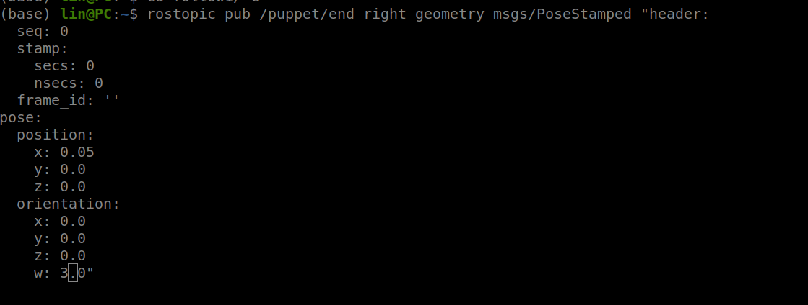

# 1 硬件参数

## 1.1 夹持端参数

  

|||
|:-:|:-:|
|夹持范围​|0-80mm​|
|反馈及控制方式​|位置 速度 扭矩​​|
|最大夹持力|10NM​|
|重量​|约585g|
|||

## 1.2 手持端参数

|||
|:-:|:-:|
|反馈及控制方式​|位置 速度 扭矩​​|
|重量​|约640g​|
|||

# 2 环境配置

+ 配置好ros1即可, 其他依赖缺啥安装啥
+ 松灵出厂的工控机可以忽略该步骤

~~~python
# 1 删除编译的中间文件
./tools/delete_build_file.sh

# 2 编译每个机械臂工作空间
./tools/build.sh
~~~

# 3 机械臂坐标系示意图

+ tip pose以零位姿态link6为固定坐标系原点
+ joint state以零位状态为0°开始计算角度

1. link6固定坐标系原点示意图

  

2. 零位示意图

  
  &nbsp;
  

3. 空间某位置

  
  &nbsp;
  

# 4 机械臂控制
## 4.1 关节角度joint_state控制
~~~python
# 1 第一次开启启动都需要can使能, 运行下面脚本，如果重启电脑，还需要运行该脚本
./tools/can.sh

# 2. 启动遥操作, 启动前需要关闭一切控制机器臂的程序
./tools/remote.sh

# 3. 启动从臂, 启动前需要关闭一切控制机器臂的程序
./tools/puppet.sh

# 4 启动任意臂
请参考./tools/remote.sh与./tools/puppet.sh脚本自行修改
~~~

## 4.2 末端姿态tip pose控制

~~~python
# 1 第一次开启启动都需要can使能, 运行下面脚本，如果重启电脑，还需要运行该脚本
./tools/can.sh

# 2. 启动遥操作, 启动前需要关闭一切控制机器臂的程序
./tools/pos_remote.sh

# 3. 启动从臂, 启动前需要关闭一切控制机器臂的程序
./tools/pos_puppet.sh

# 4 启动任意臂
请参考./tools/pos_remote.sh与./tools/pos_puppet.sh脚本自行修改
~~~

# 5 ros消息类型说明

## 5.1 关节角度joint_state
`JointControl.msg`与`JointInformation.msg`
~~~python
# 1 joint_state关节角度： sensor_msgs::JointState
std_msgs/Header header
  uint32 seq
  time stamp              # 时间戳
  string frame_id        
string[] name             # 关节名字
float64[] position        # 角度 0-5维为每个关节的角度(rad)，第6维为gripper(注意夹爪 0-5rad 对应 0-80mm)
float64[] velocity        # 关节速度 rad/s
float64[] effort          # 关节扭矩 n·m
~~~

## 5.2 Tip Pose

`PosCmd.msg`
+ 以零位姿态link6为固定坐标系原点

  

~~~python
# xyz单位m, rpy单位rad，gripper(取值0-5, 映射到0-80mm)
float64 x                  
float64 y
float64 z
float64 roll
float64 pitch
float64 yaw
float64 gripper   # gripper(取值0-5rad, 映射到0-80mm)  
int32 mode1
int32 mode2
# xyz单位m, 旋转orientation部分xyz单位rad，gripper(取值0-5, 映射到0-80mm)
std_msgs/Header header
  uint32 seq
  time stamp              # 时间戳
  string frame_id         
geometry_msgs/Pose pose
  geometry_msgs/Point position
    float64 x             # x     单位m
    float64 y             # y     单位m
    float64 z             # z     单位m
  geometry_msgs/Quaternion orientation
    float64 x             # roll   单位rad
    float64 y             # pitch  单位rad
    float64 z             # yaw    单位rad
    float64 w             # gripper 取值0-5, 映射到0-80mm  
~~~

## 5.3 cobot_magic具体消息名称如下
1. sensor_msgs::JointState

+ 消息名称共4个：右主臂关节状态`/master/joint_right`, 左主臂关节状态`/master/joint_left`, 右从臂关节状态`/puppet/joint_right`, 左从臂关节状态`/puppet/joint_left` 

+ `/master/joint_right`内容如下：
~~~python
# ros打印消息内容命令：
# rostopic echo 话题名称
rostopic echo /master/joint_right

# 显示如下
header: 
  seq: 19616
  stamp:                   # 时间戳
    secs: 1720775569
    nsecs: 697398876
  frame_id: ''
name:                       # 名称
  - joint0
  - joint1
  - joint2
  - joint3
  - joint4
  - joint5
  - joint6                 # gripper
position: [0.2557792663574219, 1.796177864074707, 1.2426567077636719, -0.5769815444946289, -0.01125335693359375, 0.041008949279785156, 3.005075454711914]        # 转角
velocity: [-0.010990142822265625, -2.7802200317382812, 1.0879135131835938, -0.09889984130859375, -0.03296661376953125, -0.03296661376953125, -0.010990142822265625]    # 速度
effort: [-0.013187408447265625, -6.632966995239258, 5.006593704223633, 1.8241748809814453, -0.013187408447265625, -0.013187408447265625, -0.013187408447265625]  # 扭矩
~~~

2. geometry_msgs::PoseStamped

+ 消息名称共4个：右主臂末端姿态`/master/end_right`，左主臂末端姿态`/master/end_left`, 右从臂末端姿态`/puppet/end_right`, 左从臂末端姿态`/puppet/end_left`

+ 左从臂末端姿态`/puppet/end_left`内容如下：
+ **这里注意,使用了四元素的w分量来存储的gripper的数值**

~~~python
header: 
  seq: 21378
  stamp:                         # 时间戳
    secs: 1720775578
    nsecs: 507354757
  frame_id: ''
pose: 
  position: 
    x: -0.0017316965386271477   # x
    y: -0.004632180090993643    # y
    z: -0.008783199824392796    # z
  orientation: 
    x: -0.014360900036990643    # roll
    y: 0.15038831532001495      # pitch
    z: 0.008544730953872204     # yaw
    w: -0.01049041748046875     # gripper
~~~

## 5.4 控制从臂操作

~~~python
# 1 启动从臂
./tools/pos_puppet.sh

# 2 发布joint state消息控制右从臂
rostopic pub /master/joint_right sensor_msgs/JointState + tab键补全
# tab键会自动补全
# 注意安全！注意安全！注意安全！
# 每个joint建议先给0.1做测试, 不要给太大，容易发生安全事故

# 3 发布tip pose消息控制右从臂
rostopic pub /master/end_right geometry_msgs/PoseStamped + tab键
# tab键会自动补全，如下图所示
# 注意安全！注意安全！注意安全！
~~~

+ 注意这是测试：x给的0.05表示x方向前进0.05m，w给3表示张开夹爪到3位置。
+ 采用tip pose方式控制机械臂一定要注意安全，xyz不要给太大，建议小于0.05m, 因为是瞬时到达末端姿态。
+ **给的xyz值大于0.05m出了安全事故，后果自负**，**旋转给0测试**，这里只是为了验证，是否支持末端控制，
+ 建议采用**给定末端姿态后进行插值处理**，然后采用第4节的方式发布ros消息, 进行控制机械臂。
+ **注意安全！注意安全！注意安全！**

# 6 订阅与发布消息代码样例

## 6.1 订阅

1. 订阅`sensor_msgs::JointState`类型：右主臂关节状态`/master/joint_right`,

~~~python
#!/home/lin/software/miniconda3/envs/aloha/bin/python
#coding=utf-8
import rospy
from sensor_msgs.msg import JointState

# 保存函数
def save_data(data):
    pass

# 回调函数
def callback(msg):
    print(msg)
    # print(msg.position)
    # print(msg.velocity)
    # print(msg.effort)
    save_data(msg.position)  # 保存需自定义

# 主函数创建订阅者
if __name__ == "__main__":
    rospy.init_node("ros_node") 
    rospy.loginfo("start...")
    topic_name = "/master/joint_right"
    sub = rospy.Subscriber(topic_name, JointState, callback)
    rospy.spin()  
~~~

2. 订阅`geometry_msgs::PoseStamped`类型：右主臂关节状态`/master/end_right`,

~~~python
#!/home/lin/software/miniconda3/envs/aloha/bin/python
#coding=utf-8
import rospy
from geometry_msgs.msg import PoseStamped

# 保存函数
def save_data(data):
    pass

# 回调函数
def callback(msg):
    print(msg)
    save_data(msg)  # 保存需自定义

# 主函数创建发布者
if __name__ == "__main__":
    rospy.init_node("ros_node") 
    rospy.loginfo("start...")
    topic_name = "/master/end_right"
    sub = rospy.Subscriber(topic_name, PoseStamped, callback)
    rospy.spin()   
~~~

## 6.2 发布消息

1. 发布`sensor_msgs::JointState`类型：右主臂关节状态`/master/joint_right`,
~~~python
#!/home/lin/software/miniconda3/envs/aloha/bin/python
#coding=utf-8
import rospy
from sensor_msgs.msg import JointState

if __name__ == "__main__":
    rospy.init_node("ros_node") 
    rospy.loginfo("start...")
    topic_name = "/master/joint_right"
    pub = rospy.Publisher(topic_name, JointState, queue_size=10) # 创建发布器
    rate = rospy.Rate(30)
    while not rospy.is_shutdown():
        msg = JointState()
        # 消息赋值
        msg.header.stamp = rospy.Time.now()
        msg.name = ['joint0', 'joint1','joint2', 'joint3', 'joint4', 'joint5','joint6']  
        msg.position = [1.0, 0.5, 0.2, 1.0, 0.5, 0.2, 0.3] 
        msg.velocity = [1.0, 0.5, 0.2, 1.0, 0.5, 0.2, 0.3] 
        msg.effort = [1.0, 0.5, 0.2, 1.0, 0.5, 0.2, 0.3] 
        
        rospy.loginfo(msg)  # 打印消息
        pub.publish(msg)    # 发布消息
        rate.sleep()
~~~

2. 发布`geometry_msgs::PoseStamped`类型：右主臂关节状态`/master/end_right`,

~~~python
#!/home/lin/software/miniconda3/envs/aloha/bin/python
#coding=utf-8
import rospy
from geometry_msgs.msg import PoseStamped

if __name__ == "__main__":
    rospy.init_node("ros_node") 
    rospy.loginfo("start...")
    topic_name = "/master/end_right"
    pub = rospy.Publisher(topic_name, PoseStamped, queue_size=10) # 创建发布器
    rate = rospy.Rate(30)
    while not rospy.is_shutdown():
        msg = PoseStamped()
        msg.header.stamp = rospy.Time.now()
        msg.pose.orientation.x = 1
        msg.pose.orientation.y = 0
        msg.pose.orientation.z = 0
        msg.pose.orientation.w = 0
        msg.pose.position.x = 1
        msg.pose.position.y = 1
        msg.pose.position.z = 1
        rospy.loginfo(msg)       # 打印消息
        pub.publish(msg)         # 发布消息
        rate.sleep()
~~~

# 7 异常处理
| ​  |   |
| :-: | :-: |
| 机械臂垂落，无法控制​  | 终端是否提示safe mode（碰撞检测进入保护模式，断电复位，重启即可）  |
| 检查can连接 |  确保硬件稳定连接​  |
| 其他问题 ​| 请联系售后 |
| ​  |   |

